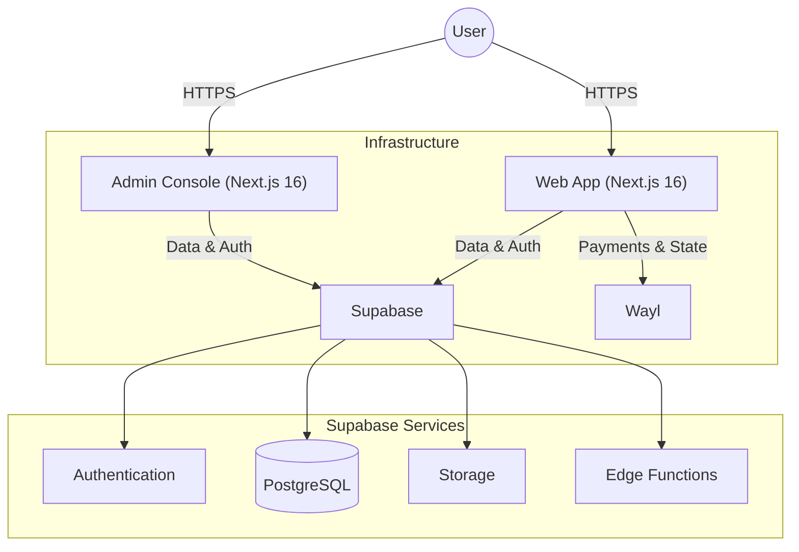

# The IDEA IQ Monorepo


A modern, high-performance monorepo for **The IDEA IQ**, built with **Next.js 16**, **Tailwind CSS 4**, and **Supabase**.

## 🏗 Architecture

The system is designed as a centralized routing hub and application suite.



## 🛠 Tech Stack

- **Apps**: Next.js 16 (App Router), React 19
- **Styling**: Tailwind CSS 4, Framer Motion
- **State**: Zustand, React Query
- **Backend**: Supabase (PostgreSQL, Auth, Edge Functions)
- **Monorepo**: Turborepo, pnpm
- **Tooling**: Biome (Lint/Format), Syncpack (Dependency Sync), Changesets

## 📦 Repository Structure

This monorepo is managed with [Turborepo](https://turbo.build/) and [pnpm](https://pnpm.io/).

### Apps
- [`apps/web`](./apps/web): Public-facing web application.
- [`apps/admin`](./apps/admin): Internal administration dashboard.
- [`apps/droid`](./apps/droid): Telegram bot powered by Google Gemini.

### Packages
- [`packages/ui`](./packages/ui): Shared UI component library (Tailwind 4 + React).
- [`packages/config`](./packages/config): Shared configuration (TypeScript, Biome).
- [`packages/utils`](./packages/utils): Shared utility functions (Date, String, Math helpers).
- [`packages/database`](./packages/database): Type-safe Supabase client and schema definitions.
- [`packages/env`](./packages/env): Environment variable validation and type-safety.
- [`packages/payment-engine`](./packages/payment-engine): Payment processing abstraction layer (Wayl, ZainCash).
- [`packages/wayl`](./packages/wayl): Type-safe client SDK for the Wayl payment gateway.

## 🚀 Getting Started

### Prerequisites

- **Node.js**: v24.12.0 or higher
- **pnpm**: v10.27.0 or higher

### Installation

1.  **Clone the repository:**
    ```bash
    git clone <repository-url>
    cd <project-directory>
    ```

2.  **Install dependencies:**
    ```bash
    pnpm install
    ```

3.  **Environment Setup:**
    Create a local environment file in `apps/web`, `apps/admin`, and `apps/droid`:

    ```bash
    cp apps/web/.env.example apps/web/.env.local
    cp apps/admin/.env.example apps/admin/.env.local
    cp apps/droid/.env.example apps/droid/.env.local
    ```

4.  **Run Development Server:**
    ```bash
    pnpm dev
    ```
    - Web: [http://localhost:3000](http://localhost:3000)
    - Admin: [http://localhost:3001](http://localhost:3001)
    - Droid: Local process (Port varies)

## 🔐 Environment Variables

Proper management of environment variables is crucial for security and deployment.

### Development
Use `.env.local` files in the respective app directories (`apps/web`, `apps/admin`, `apps/droid`). **Never commit these files.**

### CI/CD & Production
**Do not store secrets in the codebase.**

- **Vercel**: Navigate to **Settings > Environment Variables** in your Vercel project dashboard to add secrets (e.g., `NEXT_PUBLIC_SUPABASE_ANON_KEY`, `SUPABASE_SERVICE_ROLE_KEY`).
- **GitHub Actions**: Navigate to **Settings > Secrets and variables > Actions** in your GitHub repository. Add secrets required for the CI workflow (e.g., `NEXT_PUBLIC_SUPABASE_URL`).

## 📜 Scripts

| Command | Description |
| :--- | :--- |
| `pnpm dev` | Start all apps in development mode. |
| `pnpm build` | Build all apps and packages for production. |
| `pnpm check` | Run Biome linting and formatting check. |
| `pnpm format` | Fix linting and formatting issues automatically. |
| `pnpm test` | Run unit tests across the workspace. |
| `pnpm sync` | Ensure dependency versions are consistent across packages (Syncpack). |
| `pnpm changeset` | Generate a changeset for versioning. |

## 🐛 Known Issues

### Disabled Capacitor Patch
The `@capacitor/cli` patch file (`patches/@capacitor__cli.patch`) exists but is currently disabled (not applied). The `patchedDependencies` entry has been temporarily removed from `package.json` to allow `pnpm install` to succeed in environments with strict dependency resolution.

**Impact:** This may affect mobile builds if the `tar` version override causes compatibility issues with `@capacitor/cli`.
**Workaround:** If you encounter issues with Capacitor CLI, verify that your environment meets the `tar` requirements or wait for the patch to be restored.

## 🧠 Memory (AGENTS.md)

The `AGENTS.md` file contains the long-term memory and context for AI agents working on this project. It documents architectural decisions, design patterns, security protocols, and operational learnings.

**Please do not delete this file**, as it ensures continuity and high-quality assistance from AI tools.

## 📄 License

**All Rights Reserved.**

Copyright © 2017-2026 The IDEA.

This software is proprietary. Unauthorized copying, modification, distribution, or use of this software is strictly prohibited.
